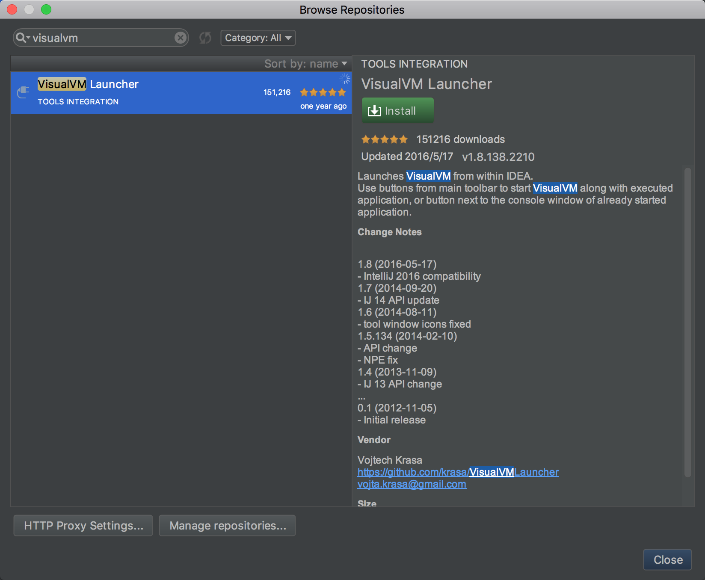

## Visual VM 的安装

Visual VM 通常附带在 JDK 中，无需安装，在 JDK 目录中打开 jvisualvm 即可开始使用。但为了方便开发时结合 IDE 进行使用，可以通过插件的形式使得在 IDE 中调试程序时可以自动启动 Visual VM。以 Intellij Idea 为例，在 `Preference -> Plugins -> Browse Repositories` 中搜索 Visual VM 并安装插件：

重启 IDE 后即可在顶部的运行 Button 区看到新增的两个「运行」和「调试」按钮，只要通过这两个按钮运行或调试程序，Visual VM 就会自动启动并显示该程序启动的 JVM 的运行情况：

本文由 [Eason Yang](https://eason-yang.com) 创作，采用*[署名 4.0 国际（CC BY 4.0）创作共享协议](http://creativecommons.org/licenses/by/4.0/deed.zh)*进行许可，[详细声明 ](https://eason-yang.com/about/)。