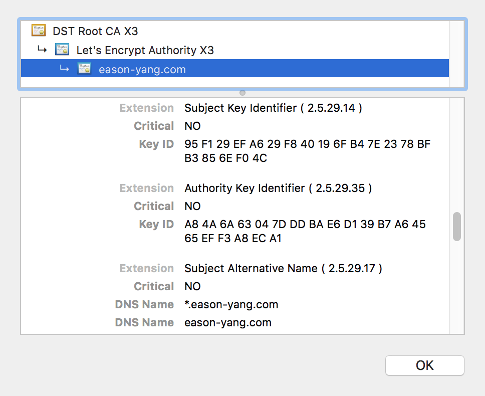
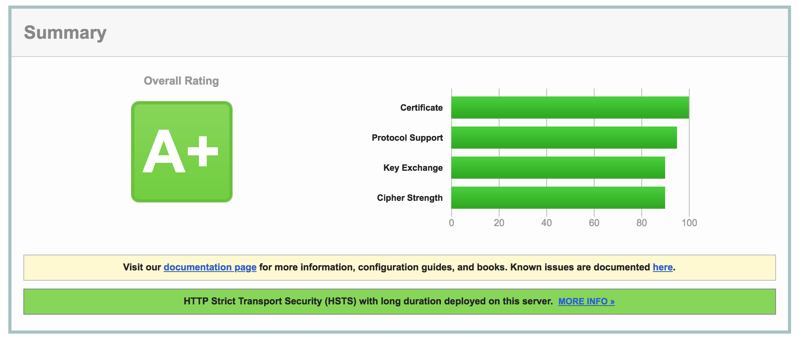

## 背景

去年看到 Let's Encrypt 宣布将在 2018 年支持 wildcard SSL 证书的消息时就一阵兴奋，虽然后来跳票了一次，但最终还是于前段时间正式支持了。本文将使用 acme.sh 这个小工具来体验下此项特性。

## 签发证书

Let's Encrypt 使用 ACME 协议验证域名的归属，官方证书签发工具是 [Certbot](https://certbot.eff.org/) 。除了官方工具，还有许多第三方工具，原理都大同小异，但有些第三方工具的功能更具有可玩性。本文一直使用 acme.sh 来签发证书，此次的 wildcard 证书签发也不例外。首先安装 amce.sh ：

`curl https://get.acme.sh | sh`

由于 CloudXNS 的政策问题，本站目前暂使用域名提供商 namesilo 的 DNS 服务。acme.sh 需要借助 dns_lexicon 来调用 namesilo 的 API 进行域名验证。安装 dns_lexicon ：

`pip install dns-lexicon`

在 https://www.namesilo.com/account_api.php 申请 token 后，编辑 acme.sh 的目录中的 `account.conf` ，追加如下内容：

```
PROVIDER=namesilo
LEXICON_NAMESILO_TOKEN=#{Applied from namesilo}
```

随后即可申请签发证书。在 Let's Encrypt 的 wildcard SSL 证书出现前，我的签发证书命令是这样的：

```sh
./acme.sh --issue --reloadcmd "nginx -s reload" --dns dns_lexicon  --dnssleep 960 -d eason-yang.com -d www.eason-yang.com -d note.eason-yang.com -d search.eason-yang.com -d status.eason-yang.com -d wiki.eason-yang.com -d m.wiki.eason-yang.com -d up.wiki.eason-yang.com -d fonts.eason-yang.com -d jiathis.eason-yang.com -d v3.jiathis.eason-yang.com -d disqus.eason-yang.com -d s.jiathis.eason-yang.com -d gstatic.eason-yang.com -d easonyang.disqus.eason-yang.com -d disquscdn.eason-yang.com -d test.eason-yang.com -d i.eason-yang.com -d img.eason-yang.com -d file.eason-yang.com -d static.eason-yang.com --certhome /etc/lets-encrypt/eason-yang/rsa -f
```

而现在，命令可以简化如下：<!--more--> 

```sh
./acme.sh --renew --reloadcmd "nginx -s reload" -d eason-yang.com -d *.eason-yang.com --certhome /etc/lets-encrypt/eason-yang/rsa --dns dns_lexicon --dnssleep 960 --force
```

可以说大大精简了签发多域名证书的成本。另一方面，由于 Let's Encrypt 对签发失败的次数有明确的限制（https://letsencrypt.org/docs/rate-limits），在过去，如果因为配置问题导致续签任务执行失败，在签发域名过多的情况下是有可能达到签发频率上限造成一周内无法再次签发证书从而影响网站访问的。而在其 wildcard 证书出现后，这一问题终于得以缓解。

Let's Encrypt 的证书每 3 个月需要续签一次，除了可以使用 amce.sh 自身的 cron 定时任务进行处理外，我们还可以手动设定 cron 命令，以满足如同时签发 ecc 证书等定制化需求。示例如下：

```sh
0 0 1 * * cd /etc/lets-encrypt/eason-yang/ && ./acme.sh --renew --reloadcmd "nginx -s reload" -d eason-yang.com -d *.eason-yang.com --certhome /etc/lets-encrypt/eason-yang/rsa --dns dns_lexicon --dnssleep 960 --force 2>&1 | tee -a /etc/lets-encrypt/eason-yang/acme.log
```

Tips:

1. 对于 ecc 证书，只需在首次签发时加上 `-k ec-256` 参数、在续签时加上 `--ecc` 参数即可。
2. 注意，如果你不确定是否配置正确，请在命令中添加 `--staging` 标识出此次签发申请为测试申请，以免在测试阶段就达到了签发频率上限。

## 效果

Chrome 上可以看到证书已经加上了 wildcard 的 DNS 项：



SSL Labs 的测试仍然是 A+ 得分：



## 参考资料

- [Let's Encrypt Docs](https://letsencrypt.org/docs/)
- [acme.sh](https://github.com/Neilpang/acme.sh)
- [Dns Lexicon](https://github.com/AnalogJ/lexicon)
- [开始使用 ECC 证书](https://imququ.com/post/ecc-certificate.html)

本文由 [Eason Yang](https://eason-yang.com) 创作，采用*[署名 4.0 国际（CC BY 4.0）创作共享协议](http://creativecommons.org/licenses/by/4.0/deed.zh)*进行许可，[详细声明 ](https://eason-yang.com/about/)。