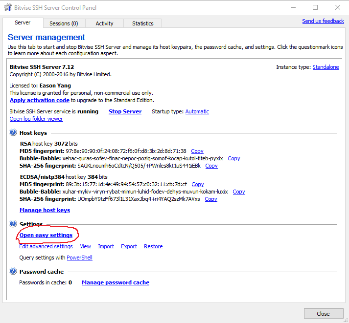
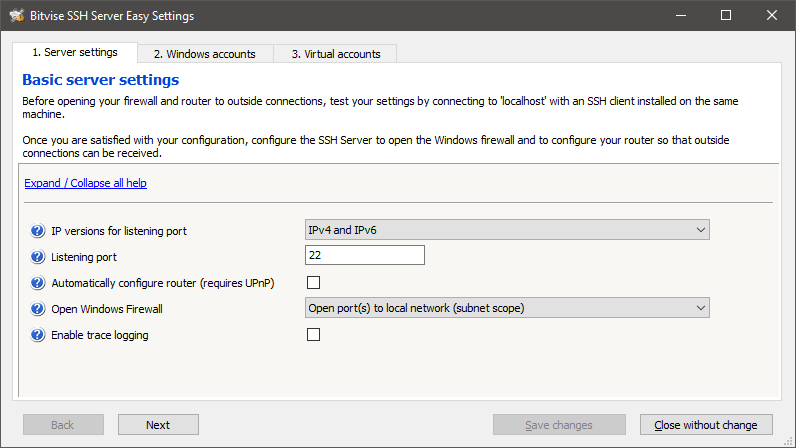
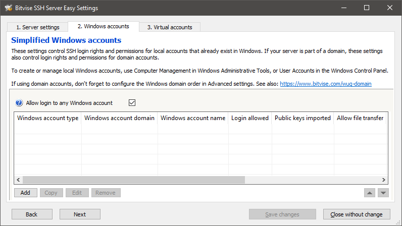
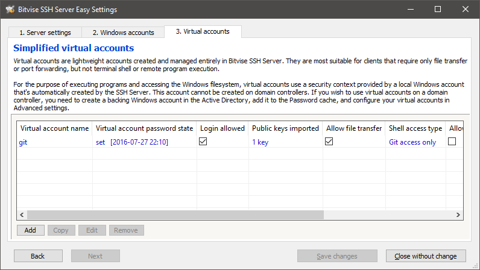
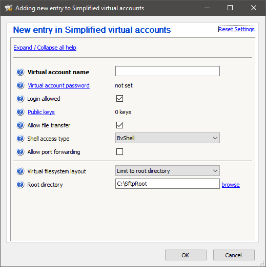
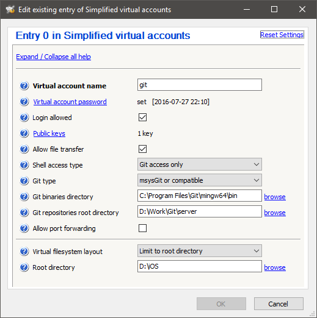

由于最近要在一个仅装有 Windows 的无外网环境下写一个小项目，无法连接我自己建在远程服务器上的 Git Server，所以在 Windows 下临时简单搭建一个 Git 服务器来做版本控制。

## 给 Windows 安装 SSH 服务器

由于 Windows 本身并没有 SSH 相关的组件，所以我们需要先进行 SSH 服务器的安装。与 Linux 下的 OpenSSH 不同，Windows 下并没有一个得到广泛认同的 SSH 软件，各种工具五花八门，本文使用Bitvise SSH Server ，该工具对非商业用途免费，虽然免费版限制一些功能的使用，但对我来说足够使用。但如果是超过10个人以上的或者商用的团队则应该购买商业授权或者使用其他同类软件。在官网下载后一路 Next 安装即可。<!--more-->

## 配置 Bitvise 

安装后在主界面点击 Open easy settings：

打开后我们可以看到在第一项 Server setting 中可以设置 SSH 的端口号及防火墙，

在第二项中可以添加 windows 用户来登陆 SSH ，如果你的团队习惯于使用 Windows 系列软件工作，那么设置一下相关账户也是不错的选择。

第三项是添加虚拟账户，也就是将 SSH 账户的认证与管理交给 Bitvise。方便起见我们选择使用虚拟账户。

点击 add 后我们就可以设置一个新的虚拟账户，其实和 Linux 下的选项差不多，只是变成了图形化界面。必须要填写的是账户名、密码或公钥，注意如果想要避免以后再 Git 的使用中不停地输入密码，那么公钥的配置是必须的。随后在 Shell access type 中选择 Git access only，这样就可以具体设置 Git 信息，并在一定程度上限制这个用户使用 Shell 的权限以提高安全性。

Git type 根据你这台 Git 服务器上安装的 Git 类型选择，本文使用 Git for Windows，也就是 msysgit 。将 Git binaries directory 指定到 Git for Windows 的安装目录下的 `\mingw64\bin` 位置。Git repository root directory 指定到 Git 仓库的根目录，注意是根目录而不是仓库的具体目录，例如位于 D:\git\project 的 Git 仓库的根目录应该指定为 D:\git 。其余选项根据需要自行设置即可。点击 OK 并 Save changes 保存上述设置。

## 开始使用 Git 服务器

然后我们就可以在刚才的 Git 仓库根目录下通过 Git bash 执行 `git init --base 仓库名称` 来新建一个仓库，随后就可以在同一局域网上的计算机上通过 `git clone ssh://虚拟用户名@服务器IP地址:端口号/仓库名称` 来获取远程仓库。端口号默认是22，如果你没有在 Bitvise 的设置中修改过端口号的话在 clone 的时候就不用加上了。随后就可以随意执行你需要的 Git 命令了。

## 注意

* 必须保证 Bitvise SSH Server 在服务器上一直运行才可以正常使用
* 出现无法 clone 的情况时，如果客户端或服务器端使用了 Windows 防火墙或其他防火墙，则需要对域规则等进行修改以允许局域网内其他计算机连接本机。
* 请注意 Bitvise 的免费使用许可内容，避免滥用。

本文由 [Eason Yang](https://easonyang.com) 创作，采用*[署名 4.0 国际（CC BY 4.0）创作共享协议](http://creativecommons.org/licenses/by/4.0/deed.zh)*进行许可，[详细声明 ](https://easonyang.com/about/)。