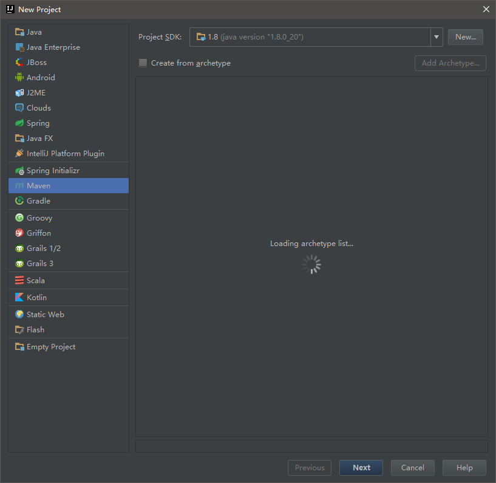
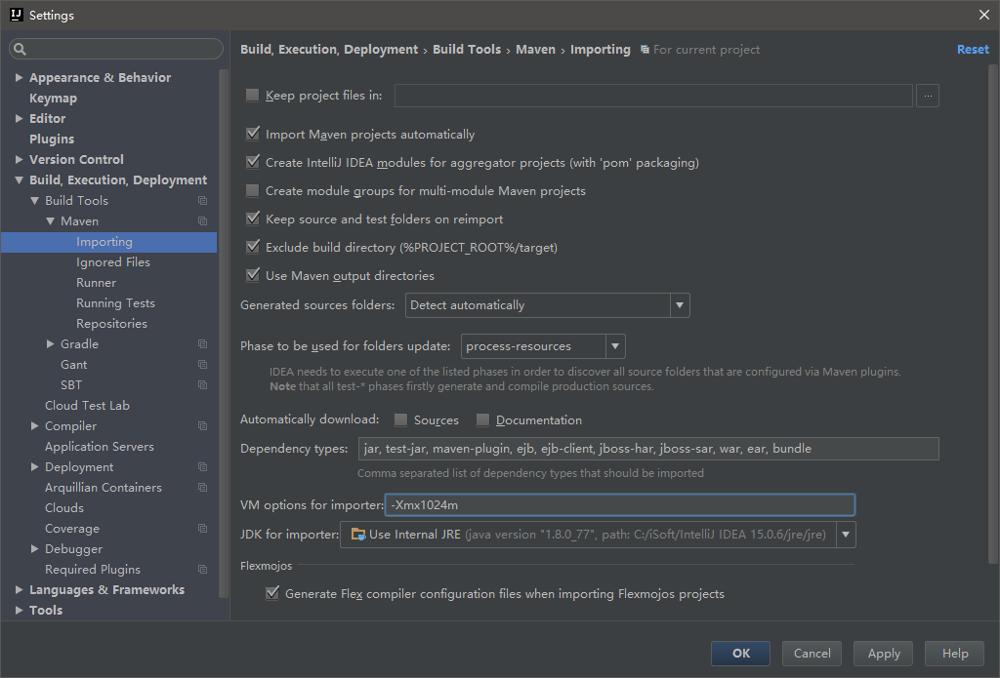

在某些场景下在 Intellij Idea 中使用 Maven 创建项目时会出现一直在 Loding archetype list 的问题，如下图。<!--more-->

在 Stackoverflow 中查到：[IntelliJ new project - maven archetype list empty](https://stackoverflow.com/questions/27893134/intellij-new-project-maven-archetype-list-empty) 中看到问题应该出在给 Maven 使用的 JRE 内存分配不足。

在设置中将默认的 `-Xmx512m` 中的512改为合适的值即可。

本文由 [Eason Yang](https://easonyang.com) 创作，采用*[署名 4.0 国际（CC BY 4.0）创作共享协议](http://creativecommons.org/licenses/by/4.0/deed.zh)*进行许可，[详细声明 ](https://easonyang.com/about/)。