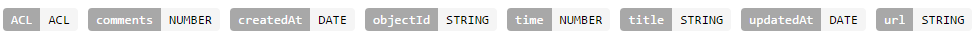
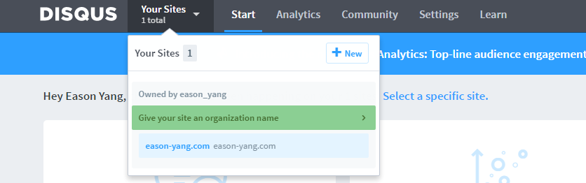

## 前言

由于 Disqus 在国内访问困难，Hexo NexT 主题每每尝试加载文章评论数时都会严重拖慢页面加载速度。除了期望读者能够使用一些其他的方法访问网站，其实站长和博主们还可以主动采取一些措施来解决这一问题。本文另辟蹊径，不借助 Nginx 的反向代理，而是使用 Disqus 和 LeanCloud 的公共 API 来曲径救国。使用 LeanCloud 的原因是 Hexo NexT 主题可以很方便地设置使用 LeanCloud 来统计访问数，所以从减少访问数、减轻服务器负载和资源合理利用等角度，再进一步地使用 LeanCloud 来存储评论数量数据。

## 准备

### 注册并初始化 LeanCloud

参见 [《Hexo的NexT主题个性化：添加文章阅读量》](http://www.jeyzhang.com/hexo-next-add-post-views.html) 一文中的 [配置 LeanCloud 部分](http://www.jeyzhang.com/hexo-next-add-post-views.html#配置LeanCloud) ，注册 LeanCloud 并初始化应用。此后，我们的博客中每篇文章的信息已经通过参考文章中的方法保存到了同一张表中，因此我们只需要对这张表添加几个字段，就可以在实现本文目的的同时，避免使用 LeanCloud API 分别查询两个表的数据所带来的不必要的请求。Counter 表的字段如下图：<!--more-->



对于不使用 LeanCloud 来统计访问量的读者，则应该根据参考文章中的方法，修改下文中的代码，为其添加初始化文章信息的功能。

### 注册并初始化 Disqus

随后我们注册一个 Disqus 账号并点击右上角的 Admin ：


接着新建一个站点：



然后参照 [How to create an API application](https://help.disqus.com/customer/portal/articles/787016-how-to-create-an-api-application) 为其开启使用 API 的权限，记下 api_key ，准备工作就完成了。

## 使用 Python 定时获取 Disqus 评论数量并更新至 LeanCloud

首先使用 LeanCloud 的 Python SDK 获取表中所有记录：

```python
LEANCLOUD_APP_ID = 'Enter your app id'
LEANCLOUD_MASTER_KEY = 'Enter your master id'
leancloud.init(LEANCLOUD_APP_ID, master_key = LEANCLOUD_MASTER_KEY)
select_sql = 'SELECT * FROM Counter' # You can replace the Counter with your own table name
leancloud_data = leancloud.Query.do_cloud_query(select_sql).results

data_dict = {}
for item in leancloud_data:
    url = item.get('url')
    data_dict[url] = {}
    data_dict[url]['id'] = item.id
    data_dict[url]['comments'] = item.get('comments')
```

然后遍历 data_dict 字典，根据评论的 uri 调用 Disqus API ，获取评论数量：

```python
FORUM_NAME = 'Your forum name'
DISQUS_API_KEY = 'Enter your disqus api key'
update_cql = 'UPDATE Counter SET comments = ? WHERE objectId = ?'
more = True
cursor = ''
disqus_api = 'https://disqus.easonyang.com/api/3.0/threads/list.json?forum=' + FORUM_NAME + '&api_key=' + DISQUS_API_KEY + '&limit=100&cursor='

while (more):
    response = urllib2.urlopen(disqus_api + cursor)
    data = json.load(response)
    comments = data['response']
    more = data['cursor']['more']
    cursor = data['cursor']['next']
    
    for comment in comments:
        if len( comment['identifiers'] ) > 0:
            object_data = data_dict.get( '/' + comment['identifiers'][0] )
            posts = comment['posts']
            if object_data != None and object_data['comments'] != posts:
                result = leancloud.Query.do_cloud_query(update_cql, posts, object_data['id'])
```

完整代码如下：

```python
import leancloud
import json
import urllib2

LEANCLOUD_APP_ID = 'Enter your app id'
LEANCLOUD_MASTER_KEY = 'Enter your master id'
FORUM_NAME = 'Your forum name'
DISQUS_API_KEY = 'Enter your disqus api key'

leancloud.init(LEANCLOUD_APP_ID, master_key = LEANCLOUD_MASTER_KEY)
select_sql = 'SELECT * FROM Counter' # You can replace the Counter with your own table name
leancloud_data = leancloud.Query.do_cloud_query(select_sql).results

data_dict = {}
for item in leancloud_data:
    url = item.get('url')
    data_dict[url] = {}
    data_dict[url]['id'] = item.id
    data_dict[url]['comments'] = item.get('comments')

update_cql = 'UPDATE Counter SET comments = ? WHERE objectId = ?'
more = True
cursor = ''
disqus_api = 'https://disqus.easonyang.com/api/3.0/threads/list.json?forum=' + FORUM_NAME + '&api_key=' + DISQUS_API_KEY + '&limit=100&cursor='

while (more):
    response = urllib2.urlopen(disqus_api + cursor)
    data = json.load(response)
    comments = data['response']
    more = data['cursor']['more']
    cursor = data['cursor']['next']
    
    for comment in comments:
        if len( comment['identifiers'] ) > 0:
            object_data = data_dict.get( '/' + comment['identifiers'][0] )
            posts = comment['posts']
            if object_data != None and object_data['comments'] != posts:
                result = leancloud.Query.do_cloud_query(update_cql, posts, object_data['id'])
```

最后保存为 scan.py ，设置定时运行，`crontab -e` 后加入如下内容，至于执行周期按照个人需求来就好：

```
10 9 * * * python /home/EasonYang/programs/disqus/scan.py
```

## 修改 Hexo 主题

在主题目录的 `themes\next\layout\_scripts\third-party\lean-analytics.swig` 中第 32 行后添加如下一行内容，实现从 LeanCloud 获取评论数并添加到页面中：

```javascript
$(element).prev().find('.disqus-comment-count').text(item.get('comments') + ' Comments');
```

随后修改主题目录中的 `themes\next\layout\_macro\post.swig` ，在 97 行后加上如下内容：

```html
            
              <span class="post-comments-count">
                &nbsp; | &nbsp;
                <a href="{{ url_for(post.path) }}#comments" itemprop="discussionUrl">
                  <span class="post-comments-count disqus-comment-count" data-disqus-identifier="{{ post.path }}" itemprop="commentsCount"></span>
                </a>
              </span>
            
```

`post.swig` 的 comment 部分最后就变为：

```html
          
            
              <span class="post-comments-count">
                &nbsp; | &nbsp;
                <a href="{{ url_for(post.path) }}#comments" itemprop="discussionUrl">
                  <span class="post-comments-count ds-thread-count" data-thread-key="{{ post.path }}" itemprop="commentsCount"></span>
                </a>
              </span>
            
              <span class="post-comments-count">
                &nbsp; | &nbsp;
                <a href="{{ url_for(post.path) }}#comments" itemprop="discussionUrl">
                  <span class="post-comments-count fb-comments-count" data-href="{{ post.permalink }}" itemprop="commentsCount">0</span> comments
                </a>
              </span>
            
              <span class="post-comments-count">
                &nbsp; | &nbsp;
                <a href="{{ url_for(post.path) }}#comments" itemprop="discussionUrl">
                  <span class="post-comments-count disqus-comment-count" data-disqus-identifier="{{ post.path }}" itemprop="commentsCount"></span>
                </a>
              </span>
            
          
```

最后，还要在配置文件中设置 disqus_shortname：

```
disqus_shortname: your_shotname
```

至此本文的目标就全部达成了。

本文由 [Eason Yang](https://easonyang.com) 创作，采用*[署名 4.0 国际（CC BY 4.0）创作共享协议](http://creativecommons.org/licenses/by/4.0/deed.zh)*进行许可，[详细声明 ](https://easonyang.com/about/)。